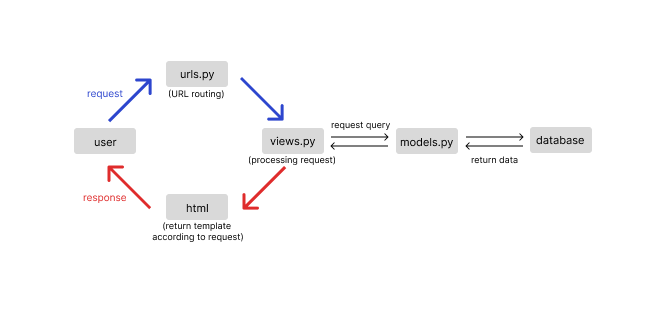

Link menuju aplikasi heroku: [katalog](https://pbp-katalog.herokuapp.com/katalog/)

### Bagan request client beserta responnya

Permintaan _(request)_ dari pengguna _(user)_ akan diteruskan ke urls.py untuk dilakukan proses _url routing_ atau pemetaan. Selanjutnya, permintaan tersebut diteruskan ke _view.py_ untuk diproses. Apabila 
permintaan tersebut membutuhkan data dari _database_, maka _views.py_ akan memanggil _query_ ke _models.py_ yang akan menyebabkan _database_ mengembalikan data yang dibutuhkan ke _views.py_. Setelah itu, 
akan dilakukan pemilihan template pada berkas html yang sesuai dengan permintaan untuk ditampilkan sebagai bentuk respon dari permintaan yang diteruskan oleh pengguna.

### Mengapa menggunakan _virtual environment?_ Apakah aplikasi web berbasis Django tetap dapat dibuat tanpa menggunakan virtual environment?
_Virtual environment_ digunakan untuk membuat _project_ yang dibuat terisolasi dan tidak menimbulkan konflik dengan _dependencies project_ lain. Dengan _virtual environment_, _package_ tidak di-_install_ secara global sehingga konflik antar _project_ tidak akan terjadi. Selain itu, dengan _virtual environment_, konsistensi versi Django yang digunakan dapat terjaga karena _project_ tetap dapat dikerjakan di berbagai perangkat lain meskipun perangkat tersebut memiliki versi Django yang berbeda pada sistem. 
Aplikasi berbasis Django tetap dapat dibuat tanpa menggunakan _virtual environment_, namun hal tersebut bukanlah _best practice_. Semua _package_ akan di-_install_ secara global sehingga berpotensi menimbulkan konflik antar _project_ jika kita memiliki banyak _project_ Django lain yang dikerjakan. Selain itu, tanpa _virtual environment_, kita juga akan kesulitan untuk mengerjakan _project_ Django yang menggunakan versi django berbeda dengan versi Django yang ter-_install_ pada sistem di perangkat kita.

### Cara Pengimplementasian Tugas 2
##### 1. Membuat sebuah fungsi pada views.py
Pertama, meng-_import_ models yang berfungsi untuk mengambil data. Lalu, membuat fungsi show_katalog yang di dalamnya berisi pemanggilan fungsi _query_ ke model _database_ yang disimpan di dalam variabel. Terakhir, fungsi akan me-_return_ fungsi _render_ yang akan menampilkan data-data yang telah diambil dari model _database_ ke dalam berkas html (katalog.html).
##### 2. Melakukan routing terhadap fungsi views.py
Menambahkan path pada _urlpatterns_ di dalam file urls.py yang berada pada folder katalog dengan menambahkan potongan kode berikut `path('', show_katalog, name='show_katalog')`. Selain itu, aplikasi katalog juga didaftarkan ke dalam urls.py yang berada pada folder project django dengan menambahkan potongan kode berikut `path('katalog/', include('katalog.urls')),`.
##### 3. Memetakan data yang didapatkan ke dalam HTML
Membuat iterasi untuk melakukan pemanggilan setiap data pada variabel list barang yang telah di-_render_ sebelumnya ke dalam HTML dengan menambahkan potongan kode berikut.
```

  <tr>
    <th>{{barang.item_name}}</th>
    <th>{{barang.item_price}}</th>
    <th>{{barang.item_stock}}</th>
    <th>{{barang.rating}}</th>
    <th>{{barang.description}}</th>
    <th>{{barang.item_url}}</th>
  </tr>

```
##### 4. Melakukan deployment ke Heroku
Membuat sebuah aplikasi baru di heroku dengan nama “pbp-katalog”. Pada repositori GitHub, memasukkan heroku api key dan nama aplikasi yang telah dibuat ke dalam Secrets pada bagian GitHub Actions lalu menjalankan kembali workflow yang gagal. 
Aplikasi dapat diakses melalui: [https://pbp-katalog.herokuapp.com](https://pbp-katalog.herokuapp.com) atau [https://pbp-katalog.herokuapp.com/katalog/](https://pbp-katalog.herokuapp.com/katalog/) (untuk bagian katalog)


